<div align="center">

# 🏗️ AURA Project Diagrams & Architecture
### AI-Unified Response & Analytics - Technical Documentation

**Comprehensive System Design, Data Flow, and Architectural Patterns**

</div>

---

## 📋 Table of Contents

1. [System Architecture Overview](#1-system-architecture-overview)
2. [High-Level Architecture Diagram](#2-high-level-architecture-diagram)
3. [MVVM Architecture Pattern](#3-mvvm-architecture-pattern)
4. [Module-Specific Architecture](#4-module-specific-architecture)
5. [Data Flow Diagrams](#5-data-flow-diagrams)
6. [User Journey Maps](#6-user-journey-maps)
7. [Database Schema](#7-database-schema)
8. [API & Integration Layer](#8-api--integration-layer)
9. [Security Architecture](#9-security-architecture)
10. [Deployment Architecture](#10-deployment-architecture)

---

## 1. System Architecture Overview

AURA implements a **modern Android MVVM (Model-View-ViewModel)** architectural pattern with a centralized AI and Cloud backend. The system is designed for scalability, maintainability, and real-time responsiveness.

### Core Architectural Principles

- **Separation of Concerns** - Clear boundaries between UI, business logic, and data layers
- **Unidirectional Data Flow** - State flows down, events flow up
- **Reactive Programming** - Kotlin Coroutines and Flow for asynchronous operations
- **Dependency Injection** - Hilt for modular, testable components
- **Single Source of Truth** - Firestore as the authoritative data store

---

## 2. High-Level Architecture Diagram


### Layer Responsibilities

| Layer | Components | Responsibility |
|-------|-----------|----------------|
| **Presentation** | Composables, ViewModels | UI rendering, user interaction, state management |
| **Domain** | Use Cases, Business Logic | Application-specific business rules |
| **Data** | Repositories, Data Sources | Data access abstraction, caching |
| **Service** | Platform Services | Device capabilities, external integrations |
| **Backend** | Firebase, Cloud Functions | Authentication, storage, serverless compute |
| **AI/ML** | Gemini AI, TensorFlow | Image analysis, NLP, sentiment analysis |

---

## 3. MVVM Architecture Pattern


### Data Flow Explanation

1. **User Interaction** → User taps a button in Composable UI
2. **Event Emission** → UI emits event to ViewModel
3. **Business Logic** → ViewModel processes event through Use Case
4. **Repository Call** → Use Case requests data from Repository
5. **Data Fetch** → Repository queries Firestore/Gemini/Local storage
6. **State Update** → Repository returns data, ViewModel updates StateFlow
7. **UI Recomposition** → Composable observes StateFlow and recomposes

---

## 4. Module-Specific Architecture

### 4.1 Pink Shield (Safety Module)


**Key Components:**
- **Voice Trigger Monitor** - Background service listening for panic keyword
- **Location Tracker** - Continuous GPS monitoring during emergencies
- **Audio Recorder** - Captures 10-second ambient sound clips
- **FCM Alert Dispatcher** - Sends notifications to security and trusted contacts
- **AI Guardian** - Gemini-powered conversational interface for deterrence

---

### 4.2 Sentinel (Infrastructure Module)


**Key Components:**
- **CameraX Handler** - Manages camera lifecycle and image capture
- **Image Processor** - Compresses and prepares images for analysis
- **Gemini Vision API** - Analyzes infrastructure photos for hazards
- **Severity Classifier** - Assigns 1-5 danger rating based on AI output
- **Priority Calculator** - Determines Critical/High/Normal status
- **Ticket Generator** - Creates structured maintenance tickets

---

### 4.3 Collab-Hub (Collaboration Module)


**Key Components:**
- **Skill Extractor** - Parses project requirements and user profiles
- **Vector Search Engine** - Converts skills to numerical vectors
- **TF-IDF Vectorizer** - Creates skill embeddings
- **Cosine Similarity** - Calculates match scores between users and projects
- **Ranking Algorithm** - Orders recommendations by relevance
- **Peer Rating System** - Post-collaboration feedback mechanism
- **Badge Calculator** - Updates user reputation scores

---

## 5. Data Flow Diagrams

### 5.1 Emergency SOS Flow

```mermaid
sequenceDiagram
    participant U as User (Female Student)
    participant App as AURA App
    participant STT as Speech-to-Text
    participant WM as WorkManager
    participant LS as Location Service
    participant AR as Audio Recorder
    participant FS as Firestore
    participant FCM as Cloud Messaging
    participant TC as Trusted Contacts
    participant AD as Admin Dashboard
    
    Note over U,AD: Background: App listening for panic keyword
    
    U->>App: Speaks panic word "Aurora"
    App->>STT: Process audio locally
    STT->>App: Keyword detected ✓
    
    App->>WM: Trigger emergency protocol
    
    par Parallel Actions
        WM->>LS: Get current GPS location
        LS-->>WM: lat: 23.0225, lng: 72.5714
        
        WM->>AR: Record 10-second audio
        AR-->>WM: audio_clip.m4a
    end
    
    WM->>FS: Create emergency document
    Note right of FS: {<br/>  userId, location,<br/>  timestamp, audioUrl,<br/>  status: "active"<br/>}
    
    FS->>FCM: Dispatch alerts
    
    par Notification Distribution
        FCM->>TC: Silent SMS + App notification
        FCM->>AD: Critical alert on dashboard
    end
    
    TC-->>U: "Help is on the way"
    AD-->>U: Security team dispatched
    
    Note over U,AD: Total time: < 5 seconds
```



---

### 5.2 Infrastructure Reporting Flow


---

### 5.3 Skill Matching Flow

```mermaid
sequenceDiagram
    participant S1 as Student A (Needs designer)
    participant UI as Collab-Hub UI
    participant VM as CollabViewModel
    participant ML as ML Engine
    participant FS as Firestore
    participant S2 as Student B (UI Designer)
    
    S1->>UI: Posts project "Android App"
    UI->>VM: Submit with skills: ["UI/UX", "Figma"]
    
    VM->>ML: Extract skill vectors
    Note right of ML: TF-IDF vectorization:<br/>skills → [0.8, 0.6, 0.2, ...]
    
    ML->>FS: Query users collection
    FS-->>ML: All student profiles
    
    ML->>ML: Calculate cosine similarity
    Note right of ML: For each user:<br/>similarity = cos(θ)
    
    ML->>ML: Rank by score
    Note right of ML: Top matches:<br/>1. Student B (0.94)<br/>2. Student C (0.87)<br/>3. Student D (0.79)
    
    ML-->>VM: Recommendation list
    VM-->>UI: Display top 5 matches
    
    S1->>UI: Views Student B profile
    UI->>S2: Send collaboration request
    
    S2-->>S1: Accept request
    
    Note over S1,S2: Project completion
    
    S1->>FS: Rate Student B (5 stars)
    S2->>FS: Rate Student A (5 stars)
    
    FS->>FS: Update reputation badges
```



---

## 6. User Journey Maps

### 6.1 Female Student Emergency Journey


---

### 6.2 Infrastructure Issue Resolution Journey


---

## 7. Database Schema

### 7.1 Firestore Collections


### 7.2 Collection Indexes

**Firestore Composite Indexes:**

```javascript
// incidents collection
{
  fields: ["status", "severityLevel", "reportedAt"],
  order: "DESC"
}

// emergencies collection
{
  fields: ["status", "triggeredAt"],
  order: "DESC"
}

// projects collection
{
  fields: ["status", "createdAt", "requiredSkills"],
  order: "ASC"
}

// users collection
{
  fields: ["department", "academicYear", "skills"],
  order: "ASC"
}
```

---

## 8. API & Integration Layer

### 8.1 Firebase Cloud Functions


**Key Functions:**

1. **sendEmergencyAlerts** (onCreate trigger)
   - Triggered when new emergency document created
   - Sends FCM, SMS, and email to trusted contacts
   - Updates admin dashboard in real-time

2. **processIncidentImage** (onCreate trigger)
   - Triggered when incident image uploaded
   - Calls Gemini Vision API for analysis
   - Stores AI response in Firestore

3. **calculateMatchScores** (onUpdate trigger)
   - Triggered when user skills or projects updated
   - Runs ML matching algorithm
   - Updates recommendation cache

4. **cleanupOldData** (Scheduled daily)
   - Deletes resolved incidents older than 90 days
   - Archives emergency records
   - Maintains database performance

---

### 8.2 API Integration Architecture


---

## 9. Security Architecture

### 9.1 Authentication Flow

```mermaid
sequenceDiagram
    participant U as User
    participant App as AURA App
    participant Auth as Firebase Auth
    participant FS as Firestore
    participant Rules as Security Rules
    
    U->>App: Enter credentials
    App->>Auth: signInWithEmailAndPassword()
    
    alt Valid Credentials
        Auth-->>App: User token + UID
        App->>FS: Fetch user profile
        
        FS->>Rules: Check read permission
        Note right of Rules: rules_version = '2';<br/>allow read: if request.auth.uid == userId
        
        Rules-->>FS: Permission granted
        FS-->>App: User document
        App-->>U: Navigate to dashboard
    else Invalid Credentials
        Auth-->>App: Error: wrong password
        App-->>U: Show error message
    end
```

### 9.2 Firestore Security Rules

```javascript
rules_version = '2';
service cloud.firestore {
  match /databases/{database}/documents {
    
    // Users can read/update own profile
    match /users/{userId} {
      allow read: if request.auth != null;
      allow write: if request.auth.uid == userId;
    }
    
    // Only female students can access Pink Shield features
    match /emergencies/{emergencyId} {
      allow create: if request.auth != null && 
                       get(/databases/$(database)/documents/users/$(request.auth.uid)).data.gender == "Female";
      allow read: if request.auth.uid == resource.data.userId ||
                     hasRole('admin') || hasRole('faculty');
    }
    
    // Anyone can report incidents
    match /incidents/{incidentId} {
      allow create: if request.auth != null;
      allow read: if request.auth != null;
      allow update: if hasRole('admin') || hasRole('faculty');
    }
    
    // Students can CRUD their own projects
    match /projects/{projectId} {
      allow create: if request.auth != null && hasRole('student');
      allow read: if request.auth != null;
      allow update, delete: if request.auth.uid == resource.data.createdBy;
    }
    
    // Helper function
    function hasRole(role) {
      return get(/databases/$(database)/documents/users/$(request.auth.uid)).data.role == role;
    }
  }
}
```

### 9.3 Data Encryption


**Security Layers:**
1. **Client-Side** - Sensitive data encrypted before transmission
2. **In-Transit** - TLS 1.3 for all network communication
3. **At-Rest** - Google-managed encryption for Firestore/Storage
4. **Access Control** - Role-based security rules + Firebase Auth
5. **Audit Logging** - Cloud Functions log all sensitive operations

---

## 10. Deployment Architecture

### 10.1 Production Environment


### 10.2 Scalability Strategy

**Horizontal Scaling:**
- Firebase automatically scales to millions of concurrent users
- Cloud Functions auto-scale based on load
- Firestore supports 1M+ concurrent connections

**Performance Optimization:**
- Image compression before upload (max 1MB)
- Pagination for large data sets (20 items/page)
- Offline-first architecture with local caching
- Lazy loading for Compose UI components

**Disaster Recovery:**
- Daily automated Firestore backups
- Multi-region replication (asia-south1, us-central1)
- 99.95% uptime SLA
- Point-in-time recovery up to 7 days

---

## 📊 Performance Benchmarks

| Metric | Target | Actual |
|--------|--------|--------|
| Emergency SOS Response | < 5 sec | 3.2 sec avg |
| AI Image Analysis | < 10 sec | 7.8 sec avg |
| Skill Match Generation | < 3 sec | 2.1 sec avg |
| Dashboard Load Time | < 2 sec | 1.6 sec avg |
| Offline Data Sync | < 30 sec | 18 sec avg |

---

## 🔄 CI/CD Pipeline


---

<div align="center">

## 📚 Additional Resources

[Architecture Decision Records (ADR)](./docs/adr) | [API Documentation](./docs/api) | [Database Migrations](./docs/migrations)

---

**This document is maintained by the AURA development team**

*Last Updated: January 2025*

</div>
