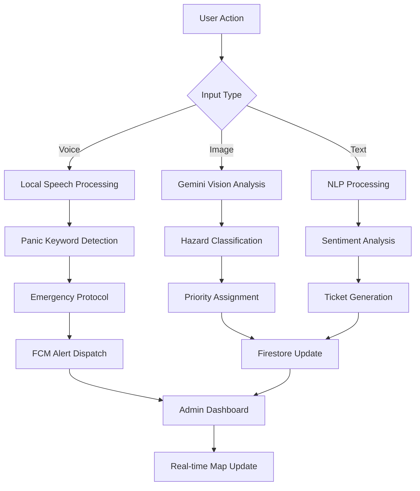

# 🌟 AURA
### AI-Unified Response & Analytics

**The Next-Generation Smart Campus Ecosystem**

---

## 📖 Overview

AURA transforms fragmented campus management systems into a **unified digital nervous system**. Acting as a centralized intelligence engine, it seamlessly integrates physical safety, infrastructure maintenance, and professional collaboration into a single, AI-powered Android application.

Built natively with **Jetpack Compose** and powered by **Google Gemini AI**, AURA shifts campus operations from reactive firefighting to proactive intelligence.

**The platform delivers:**
- ⚡ Real-time emergency response coordination
- 🔧 AI-automated infrastructure hazard detection
- 🤝 Intelligent skill-based student collaboration
- 📊 Live administrative situational awareness
- 🛡️ Privacy-first safety features for vulnerable communities

---

## 🎯 Problem Statement

<table>
<tr>
<td width="33%">

### 🚨 Campus Safety Crisis
- Emergency situations rely on manual intervention
- Victims unable to call for help during distress
- Security teams lack real-time incident visibility
- Vulnerable individuals need discrete protection

</td>
<td width="33%">

### 🏗️ Infrastructure Breakdown
- Facility issues reported too late or ignored entirely
- Manual complaint systems create resolution bottlenecks
- Minor hazards escalate into major safety incidents
- No automated severity assessment

</td>
<td width="33%">

### 👥 Collaboration Fragmentation
- Students can't find peers with complementary skills
- Talent discovery limited to immediate social circles
- No verified, merit-based collaboration system
- Professional networking happens off-platform

</td>
</tr>
</table>

---

## 🛡️ Solution Architecture

AURA is engineered around **three integrated functional pillars**:

 

### 1️⃣ Pink Shield – Advanced Safety Suite
> *Purpose-built protection for women and vulnerable community members*

**Core Capabilities:**
- **Passive SOS (Voice-Activated)** – Background listener detects user-defined panic keyword using local speech-to-text for complete privacy
- **Silent Emergency Protocol** – Automatically captures 10-second ambient audio, fetches live GPS coordinates, and transmits medical ID + distress signal to campus security and three trusted contacts via Firebase Cloud Messaging
- **AI Guardian** – Gemini-powered simulated phone call interface to deter potential harassers
- **Safe-Route Scouter** – Google Maps integration suggesting well-lit, high-traffic pedestrian paths
- **Trusted Contact Network** – Pre-configured emergency contact system with silent alert mechanism

 

### 2️⃣ Sentinel – Smart Infrastructure & Administration
> *Intelligent monitoring and automated maintenance coordination*

**Core Capabilities:**
- **Multimodal Hazard Reporting** – Users photograph infrastructure issues (broken lights, exposed wiring, structural damage); Gemini 1.5 Flash analyzes images, determines danger level (1-5 scale), and auto-generates maintenance tickets
- **Incident War-Room Dashboard** – Real-time Google Maps-based command center displaying all active incidents with dynamic priority markers (Critical/Red, High/Orange, Normal/Green)
- **Contextual Metadata System** – Each incident includes reporter identity, timestamp, elapsed time, precise coordinates, and AI-generated severity assessment
- **One-Touch Resolution** – Faculty/Admin can update incident status directly from dashboard
- **Anonymous Complaint System** – Supports sensitive reporting with Gemini-powered sentiment analysis for prioritization

 

### 3️⃣ Collab-Hub – Professional Networking Platform
> *AI-driven skill matching and project collaboration ecosystem*

**Core Capabilities:**
- **Vector Search Skill Matching** – Intelligent algorithm connects students based on complementary skill requirements for projects
- **Project Marketplace** – Students post opportunities with required skills (e.g., "Need UI designer for Android app")
- **Verified Badge System** – Merit-based reputation tracking where teammates rate each other post-collaboration
- **Transparent Credibility** – Public skill verification visible across the institution
- **Professional Portfolio Building** – Students build verifiable track records of successful collaborations

---

## 👥 User Roles & Permissions

<table>
<tr>
<th>Feature</th>
<th>Student (Male)</th>
<th>Student (Female)</th>
<th>Faculty</th>
<th>Admin</th>
</tr>
<tr>
<td><strong>SOS & Emergency Response</strong></td>
<td align="center">✅</td>
<td align="center">✅</td>
<td align="center">✅</td>
<td align="center">✅</td>
</tr>
<tr>
<td><strong>Pink Shield Features</strong></td>
<td align="center">❌</td>
<td align="center">✅</td>
<td align="center">❌</td>
<td align="center">❌</td>
</tr>
<tr>
<td><strong>Infrastructure Reporting</strong></td>
<td align="center">✅</td>
<td align="center">✅</td>
<td align="center">✅</td>
<td align="center">✅</td>
</tr>
<tr>
<td><strong>Collab-Hub Access</strong></td>
<td align="center">✅</td>
<td align="center">✅</td>
<td align="center">❌</td>
<td align="center">❌</td>
</tr>
<tr>
<td><strong>Incident Resolution</strong></td>
<td align="center">❌</td>
<td align="center">❌</td>
<td align="center">✅</td>
<td align="center">✅</td>
</tr>
<tr>
<td><strong>Faculty Management</strong></td>
<td align="center">❌</td>
<td align="center">❌</td>
<td align="center">❌</td>
<td align="center">✅</td>
</tr>
</table>

### 🔐 Authentication System

**Faculty:**
- Created and managed exclusively by Admin users
- Cannot self-register

**Student Registration:**
- Name, Enrollment Number, Mobile Number
- Department, Academic Year, Gender
- Password (Firebase Authentication)

---

## 🔧 Technical Stack

| Layer | Technology | Version | Purpose |
|-------|-----------|---------|---------|
| **UI Framework** | Jetpack Compose | 1.10.x | Modern declarative Android UI |
| **Design System** | Material Design 3 | Latest | Consistent, accessible interface |
| **Language** | Kotlin | Latest | Coroutines, Flow, Type Safety |
| **Architecture** | MVVM + Clean | - | Separation of concerns |
| **Dependency Injection** | Hilt (Dagger) | Latest | Modular architecture |
| **Backend** | Firebase | - | Authentication, Firestore, Cloud Functions |
| **Database** | Cloud Firestore | - | Real-time NoSQL database |
| **AI Engine** | Google Gemini | 1.5 Flash/Pro | Vision AI, NLP, Sentiment Analysis |
| **Maps** | Google Maps Compose | 6.1.2 | Real-time incident tracking |
| **Camera** | CameraX | Latest | Incident photo capture |
| **Image Loading** | Coil | Latest | Efficient image rendering |
| **Messaging** | Firebase Cloud Messaging | - | Push notifications |
| **Background Tasks** | WorkManager | Latest | SOS monitoring, silent alerts |
| **Location** | Google Location Services | - | GPS tracking |
| **Speech** | Android Speech-to-Text | - | Local panic keyword detection |

---

## 🔄 System Workflow

### Detailed Flow:

1. **User Input** → SOS trigger, infrastructure photo, or collaboration request
2. **AI Processing** → Gemini analyzes voice/image/text based on input type
3. **Priority Calculation** → Severity scored 1-5 with automatic categorization
4. **Action Trigger** → Emergency alert, maintenance ticket, or skill match
5. **Real-time Sync** → Firestore updates propagate to all connected dashboards
6. **Administrative Response** → Faculty/Admin view incidents on live map and take action

---

## 🔐 Privacy & Security

AURA implements privacy-by-design principles:

- 🔒 **Local Voice Processing** – Panic keyword detection runs entirely on-device using Android's native Speech-to-Text
- 🚫 **No Continuous Recording** – Only 10-second clips captured after panic word detection
- 👮 **Role-Based Access Control** – Strict Firebase security rules enforce user permissions
- 🔐 **End-to-End Encryption** – All FCM communications encrypted in transit
- 🕵️ **Anonymous Reporting** – Infrastructure complaints can be submitted without identity disclosure
- 📍 **Location Privacy** – GPS only accessed during active emergency or user-initiated reports
- 🗑️ **Data Retention Policies** – Resolved incidents archived after configurable period

---

## 📊 Key Innovation: Incident Dashboard

Based on `IncidentDashboard.kt`, administrators access:

1. **Live Incident Map** – GoogleMap Compose integration with custom markers for each emergency type
2. **Five-Point Danger Scale** – Visual severity indicators for every reported hazard
3. **One-Touch Resolution** – Update Firestore incident status directly from dashboard
4. **Priority Color Coding** – Instant visual triage (Critical/Red, High/Orange, Normal/Green)
5. **Rich Metadata Display** – Reporter identity, time elapsed since report, precise coordinates, AI analysis results
6. **Filter & Search** – Query incidents by type, status, severity, or date range

---

## 📈 Scalability & Impact

### Deployment Flexibility
AURA's modular architecture enables deployment across:
- 🎓 **Educational Institutions** – Colleges, universities, K-12 campuses
- 🏘️ **Residential Communities** – Gated societies, apartment complexes
- 🏢 **Corporate Campuses** – Tech parks, office complexes
- 🏭 **Industrial Facilities** – Manufacturing plants, warehouses

> Each pillar (Pink Shield, Sentinel, Collab-Hub) can be independently enabled/disabled based on deployment context.

### Social Impact
- **Safety Enhancement** – Reduces emergency response time from minutes to seconds
- **Infrastructure Efficiency** – Prevents minor hazards from escalating into major incidents
- **Community Building** – Breaks down skill-discovery barriers for student collaboration
- **Inclusivity** – Material 3 accessibility standards + multi-language support
- **Gender Safety** – Purpose-built features address unique security concerns for women

### Technical Advantages
- **Proactive vs Reactive** – AI prediction prevents issues before they occur
- **Reduced Operational Cost** – Automated triage reduces administrative overhead
- **Data-Driven Decisions** – Historical analytics inform resource allocation
- **Ecosystem Integration** – Leverages full Google stack (Maps, Gemini, Firebase, Android)

---

## 🚀 Why AURA Wins

Unlike traditional campus apps that function as simple directories or bulletin boards, AURA is an **active participant in campus operations**:

| Traditional Systems | AURA |
|---------------------|------|
| Manual emergency calls | Voice-activated silent SOS |
| Paper-based maintenance requests | AI-powered image analysis with auto-ticketing |
| Bulletin board job postings | Intelligent skill-vector matching |
| Reactive incident response | Predictive hazard prevention |
| Fragmented tools | Unified intelligence platform |

**By combining Vision AI for infrastructure monitoring and Voice AI for safety coordination**, AURA provides security and operational efficiency that manual systems fundamentally cannot match.

---

*Shifting from Reactive to Proactive Campus Intelligence*

